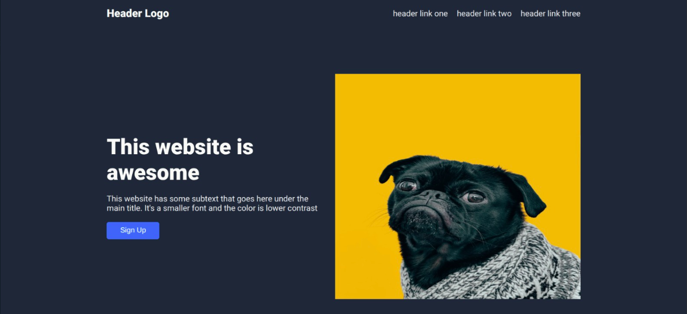
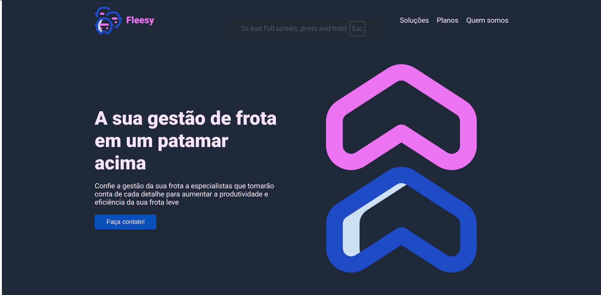

This project is part of the The Odin Project foundations course. The goal here is to practice the concepts of HTML and CSS
that were presented along the path.

The project started with the default design shown below.

After that, I changed the content to a more real-world project, which is the final version with the fleet management subject.

I
All the icons have been downloaded from Flaticon.com

https://www.flaticon.com/authors/super-basic-orbit/color/7?author_id=1&type=standard